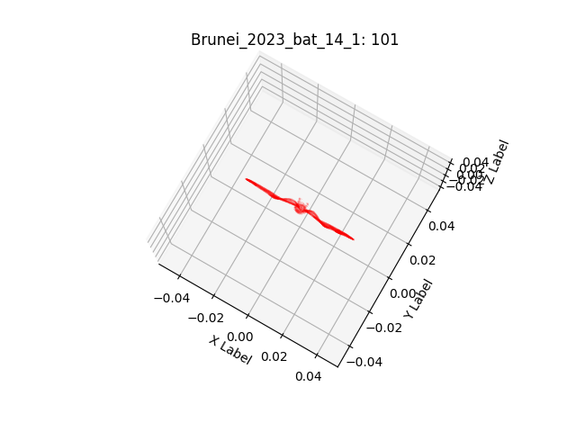
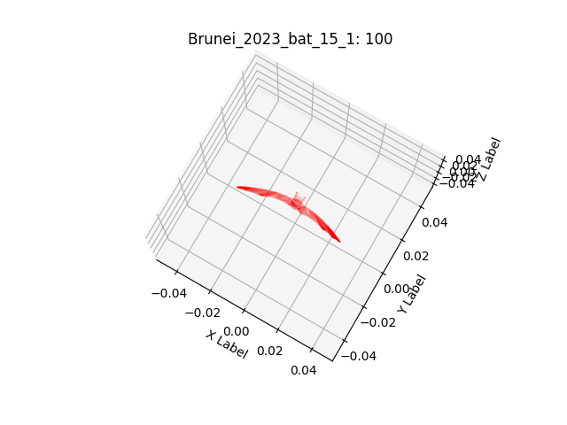
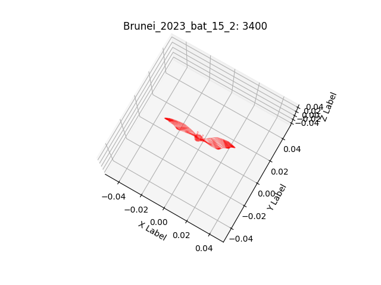
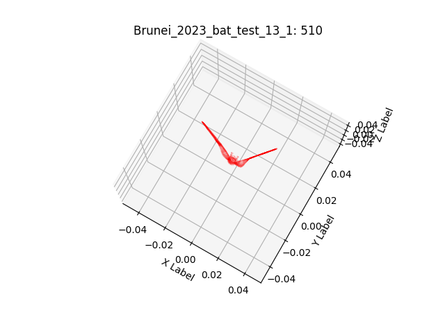
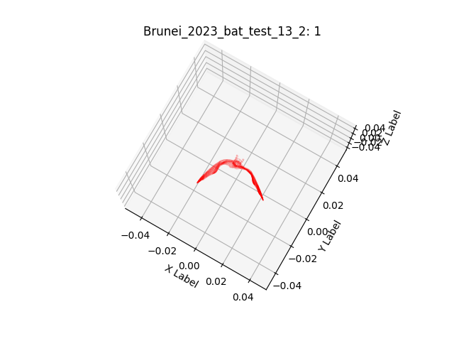
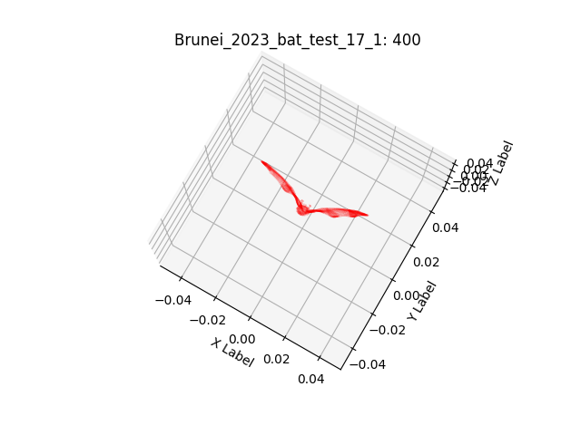

# Kinematic and membrane reconstruction.
## Digital mesh and skeleton design

  <figure  style="text-align: center;">
    
  </figure>

## Kinematic optimization pipeline

  <figure  style="text-align: center;">
    
  </figure>

## Membrane optimization pipeline

  <figure  style="text-align: center;">
    
  </figure>

## Kinematic update pipeline

  <figure  style="text-align: center;">
    
  </figure>

---

## Kinematic reconstruction (2023)

<!-- Container: flex layout, wraps to next line if viewport shrinks -->

  <!-- Each image: width ~19% so 5 fit across with small gaps.
       aspect-ratio:1/1 keeps it square, object-fit:cover crops to fill.
       Replace src="..." with your image URL (e.g., images/pic1.png or raw githubusercontent link).
       Wrap with <a> to make the image clickable (optional). -->

  <figure  style="text-align: center;">
    
  </figure>

  <figure style="text-align: center;">
    
  </figure>

  <figure style="text-align: center;">
    
  </figure>

  <figure style="text-align: center;">
    
  </figure>

  <figure style="text-align: center;">
    
  </figure>

  <figure  style="text-align: center;">
    
  </figure>

  <figure  style="text-align: center;">
    
  </figure>

  <figure style="text-align: center;">
    
  </figure>

  <figure  style="text-align: center;">
    
  </figure>

## Kinematic reconstruction (2024)

    <figure  style="text-align: center;">
        
    </figure>
    <figure  style="text-align: center;">
        
    </figure>
    <figure  style="text-align: center;">
        
    </figure>
    <figure  style="text-align: center;">
        
    </figure>
    <figure  style="text-align: center;">
        
    </figure>
        <figure  style="text-align: center;">
        
    </figure>
    </figure>
        <figure  style="text-align: center;">
        
    </figure>
    </figure>
        <figure  style="text-align: center;">
        
    </figure>
    </figure>
        <figure  style="text-align: center;">
        
    </figure>
    

