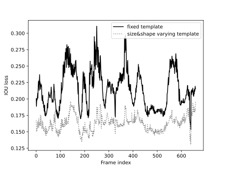
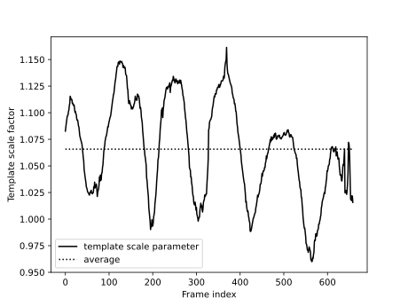
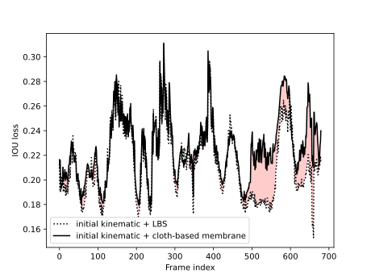
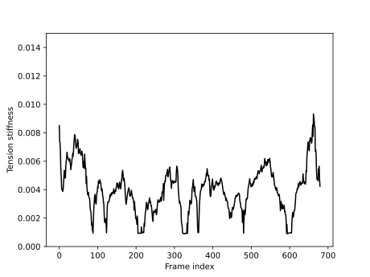
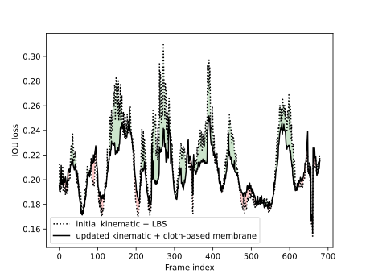

# Kinematic and membrane simulation result for Brunei_2023_bat_test_16_1
## Initial kinematic reconstruction (fixed VS size varying template)

    <figure  style="text-align: center;">
        
    </figure>
    <figure  style="text-align: center;">
        
    </figure>

## Membrane simulation (initial kinematic + LBS VS initial kinematic + cloth-based membrane)

    <figure  style="text-align: center;">
        
    </figure>
    <figure  style="text-align: center;">
        
    </figure>

## Kinematic update (initial kinematic + LBS VS update kinematic + cloth-based membrane)

    <figure  style="text-align: center;">
        
    </figure>
    <figure  style="text-align: center;">
        
    </figure>

